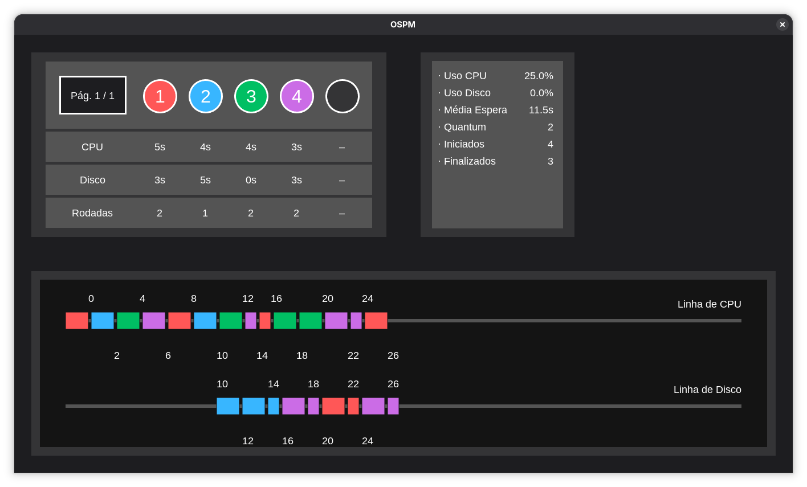
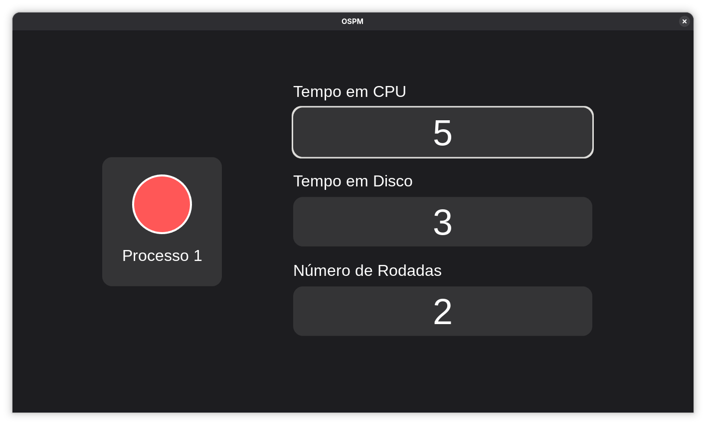

# OSPM

Um pequeno visualizador de processos escrito na linguagem C, em conjunto com a biblioteca Allegro5 para a disciplina de Sistemas Operacionais.




## Navegação

O programa suporta apenas navegação com o teclado. As teclas gerais de navegação são as setas, a tecla `Enter` para confirmações e `Esc` para correções.

Na tela de visualização, caso o usuário tenha inserido mais de 5 processos, as teclas `Tab` e `Shift` + `Tab` podem ser usadas para, respectivamente, avançar e retroceder as páginas da tabela.

## Estrutura

- `bin/`: Contém os executáveis após compilações.
- `codigo/`: Contém todo o código fonte do programa.
- `materiais/`: Contém mídia em geral a ser exibida no programa.

## Desenvolvimento

Literalmente, qualquer editor e ambiente podem ser usados para desenvolver o programa, mas abaixo vão algumas recomendações para auxiliar o desenvolvimento.

### Recomendações

- [Visual Studio Code](https://code.visualstudio.com/) com [clangd](https://marketplace.visualstudio.com/items?itemName=llvm-vs-code-extensions.vscode-clangd) (Linux)
- [Visual Studio](https://visualstudio.microsoft.com/pt-br/) (Windows)

## Compilando

Para realizar qualquer tipo de compilação, é necessário ter o GCC, o Make e o Allegro5 instalados em seu computador.

### Normal

Para uma compilação casual do programa, basta chamar o make sem nenhum argumento. O programa será executado automaticamente em seguida.

```bash
make
```

### Rápido

Caso você queira pular a intro do programa e preencher os dados automaticamente, basta executar a regra de execução rápida.

```bash
make rapido # "make r" também é aceito.
```

### Debug

Caso o programa esteja com algum bug estranho e você queira fazer um debug, basta executar a regra de debug.

```bash
make debug # "make d" também é aceito.
```

## Apêndice


